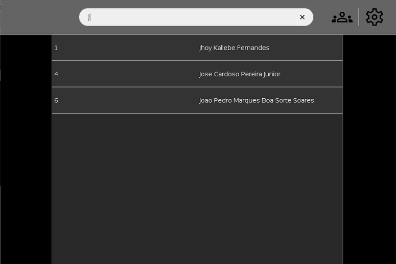

# Projeto NDPI

Tela Inicial do Adm

  

> Projeto desenvolvido com o intuito de aprimorar minhas habilidades com a linguagem JAVA, cuja finalidade é administrar pessoas e cursos dentro de uma oficina institucional.

## 🤝 Colaborador

<table>
  <tr>
    <td align="center">
      <a href="https://github.com/Jhoy-Kallebe">
         
        
          <b>Jhoy Kallebe</b>
        
      </a>
    </td>
  </tr>
</table>

## 📝 License

MIT

[⬆ Voltar ao topo](#projeto-ndpi) 
